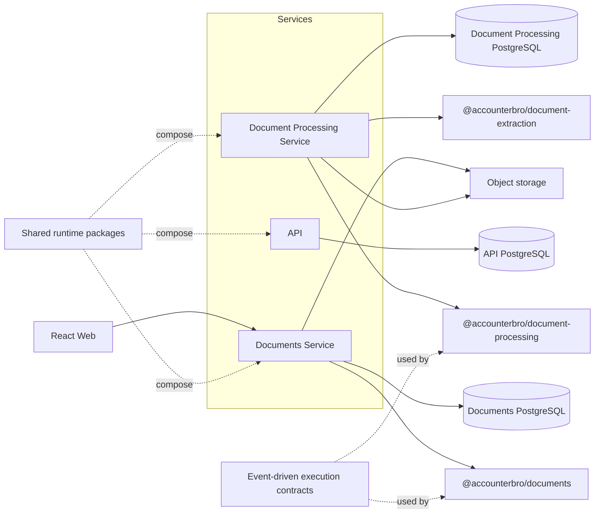

<div align="center">


# AccounterBro

**Your accounting bro. Makes the hard stuff easy.**

[](https://github.com/sanshan/accounterbro/actions/workflows/ci.yml)
[](LICENSE)
[](https://www.typescriptlang.org/)

</div>

AccounterBro is an accounting product under active development. Its goal is simple: take repetitive, confusing accounting work off your plate and turn it into clear, manageable workflows.

The product experience is intentionally friendly and straightforward: more like a capable bro next door who handles the hard parts with you than a traditional piece of accounting software.

Under the hood, AccounterBro is engineered as a production-oriented distributed system with explicit service boundaries, event-driven execution contracts, service-owned database runtimes, reusable runtime capabilities, and automated verification.

The codebase is also the executable reference for the engineering rules used to evolve the product: when a pattern becomes proven by implementation, the repository documents it so future developers and coding agents can follow the same boundaries consistently.

> **Project status:** active development. The current end-to-end web slice covers document upload backed by the Documents service. Document Processing already implements processing state, document retrieval, extraction, and OCR orchestration, but that capability is not yet exposed as an end-to-end product flow in the web application.

## What exists today

- **React web application** with the current document-upload flow.
- **Documents service** implemented as a NestJS business service with explicit presenter, application, and infrastructure boundaries.
- **Document Processing service** with concrete Process Document and Get Document Processing application use cases, durable processing state, object-storage retrieval, and document-extraction integration.
- **Business packages** that own domain/execution behavior and their business persistence artifacts independently from service hosting concerns.
- **Document Extraction capability** with routed extraction and photo OCR support behind a framework-agnostic extractor contract.
- **Shared runtime packages** for configuration, execution composition, health, observability, HTTP presentation, and object storage.
- **Service-owned PostgreSQL runtime boundaries** with explicit TypeORM lifecycle and migration execution; business-package schema and migrations stay with their owning packages.
- **Tenant-aware execution boundaries** for tenant-owned resources.
- **Unit, E2E, CI, and performance-test infrastructure** around the implemented slices.
- **Repository-native engineering and review rules** intended to be consumed by both humans and coding agents.

## Architecture

AccounterBro separates product behavior from service/runtime composition. Business packages own business execution contracts and persistence integration surfaces; deployable services compose those packages with transport and infrastructure concerns.



The PostgreSQL nodes above are logical service-owned database boundaries. Local development may host them in the same PostgreSQL server; services do not share persistence ownership.

Inside an internal service, the stable composition direction is:

```text
Presenters -> Application -> Infrastructure
```

Domain code is introduced only where the service genuinely owns domain behavior; business behavior already owned by a hosted package remains in that package.

### Engineering principles

- **Explicit boundaries over convenience coupling.** Nx and ESLint enforce project and layer dependency direction.
- **Business behavior belongs to business packages.** Services host and orchestrate capabilities rather than duplicating package-owned behavior.
- **Tenant scope is explicit.** Tenant identity flows through typed use-case and execution contracts for tenant-owned resources.
- **Runtime concerns are reusable.** Health, observability, configuration, execution composition, presenters, and storage are shared capabilities instead of copy-pasted service code.
- **Database runtime ownership is service-local.** Each service owns its database configuration, `DataSource` lifecycle, migration execution, and migration history; package-owned business schema and migrations remain with the package that owns that state.
- **Tests live at the boundary that owns the behavior.** Unit, specification, integration, E2E, and load tests have distinct responsibilities.
- **Architecture is documented from proven implementation.** Existing working references are preferred over speculative abstractions.

## Repository layout

| Path | Responsibility |
| --- | --- |
| `apps/web` | React/Vite product UI |
| `apps/api` | NestJS API host |
| `apps/services/documents` | Documents business-service host |
| `apps/services/document-processing` | Document Processing service host |
| `apps/services/documents-load` | Isolated Documents k6/performance-test environment |
| `packages/documents` | Documents business package |
| `packages/document-processing` | Document Processing business package |
| `packages/document-extraction` | Framework-agnostic document extraction and photo OCR capability |
| `packages/core` | Framework-free shared identities and references |
| `packages/runtime-*` | Reusable technical/runtime capabilities |
| `packages/object-storage` | Object-storage capability |
| `specs` | Product/application behavioral specifications |
| `docs/engineering` | Canonical engineering guidance |
| `docs/review` | Deterministic repository review rules |

## Technology

| Area | Stack |
| --- | --- |
| Language | TypeScript 5.9 |
| Workspace | Nx 23, pnpm 10 |
| Backend | NestJS 11 |
| Frontend | React 19, Vite 8 |
| Persistence | PostgreSQL, TypeORM |
| Testing | Jest, Vitest, E2E projects, load-test tooling |
| Architecture | Event-driven execution contracts, layered service composition |

## Getting started

### Prerequisites

- Node.js 24
- pnpm 10
- Docker with Docker Compose

From the repository root:

```bash
pnpm install --frozen-lockfile
cp .env.example .env
docker compose up -d database
```

The local PostgreSQL container starts with the API database. The internal services own separate logical databases; create them once in the same local PostgreSQL instance:

```bash
docker compose exec database createdb -U postgres accounterbro_documents
docker compose exec database createdb -U postgres accounterbro_document_processing
```

If either database already exists, skip its creation command.

Apply the service migrations:

```bash
pnpm nx run @accounterbro/api:migration:run
pnpm nx run @accounterbro/documents-service:migration:run
pnpm nx run @accounterbro/document-processing-service:migration:run
```

Start the applications in separate terminals as needed:

```bash
pnpm nx run @accounterbro/api:serve
pnpm nx run @accounterbro/documents-service:serve
pnpm nx run @accounterbro/document-processing-service:serve
pnpm nx run @accounterbro/web:serve
```

With the default local configuration:

- API: `http://localhost:3000`
- Documents service: `http://localhost:3001`
- Document Processing service: `http://localhost:3002`
- Web: `http://localhost:4200`

For local development, Vite proxies `/documents` requests to the Documents service and supplies the repository's development request-identity headers used by the current upload UI.

Stop PostgreSQL with:

```bash
docker compose down
```

## Verification

Run the repository checks from the root through Nx:

```bash
pnpm nx run-many -t lint
pnpm nx run-many -t typecheck
pnpm nx run-many -t test
pnpm nx run-many -t build
pnpm nx run @accounterbro/api-e2e:e2e
pnpm nx run @accounterbro/documents-service-e2e:e2e
```

The E2E targets require their normal runtime dependencies. GitHub Actions runs the repository CI and verifies the relevant built applications can start successfully.

## Product specifications

The current behavior is specified independently from transport and implementation details:

- [Register Document](specs/documents/register-document.md)
- [Get Document](specs/documents/get-document.md)
- [Process Document](specs/document-processing/process-document.md)
- [Get Document Processing](specs/document-processing/get-document-processing.md)

## Engineering documentation

The repository documentation is part of the implementation contract, not a separate aspirational architecture document.

Start with:

- [Service engineering guidelines](docs/engineering/service-guidelines.md)
- [Business package guidelines](docs/engineering/package-guidelines.md)
- [Database guidelines](docs/engineering/database-guidelines.md)
- [HTTP presenter guidelines](docs/engineering/http-presenter-guidelines.md)
- [Observability and HTTP errors](docs/engineering/observability-and-http-errors.md)
- [Environment guidelines](docs/engineering/environment-guidelines.md)
- [Service configuration guidelines](docs/engineering/service-configuration-guidelines.md)
- [Review rules](docs/review/README.md)
- [Repository agent instructions](AGENTS.md)

## License

AccounterBro is available under the [MIT License](LICENSE).
